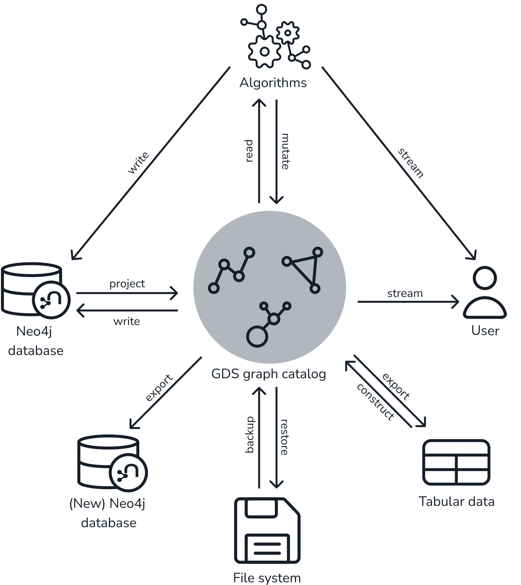

# Basic 101 Neo4j (version 5.10.0)

# Một số query cơ bản

## Import dữ liệu theo batch

Tiền xử lý dữ liệu, tách dữ liệu node và relationship thành các file JSON riêng biệt và đẩy dữ liệu vào theo batch với sự hỗ trợ của plugin [APOC](https://neo4j.com/docs/apoc/current/).

### Import Node data

```sql
CALL apoc.periodic.iterate(
    'CALL apoc.load.json("path/to/data/N_User.json") YIELD value UNWIND value.data AS user RETURN user.uid AS uid',
    'MERGE (user:User {id:uid}) ON MATCH SET user.uid = uid ON CREATE SET user.id = uid, user.uid = uid',
    {batchSize:1000, iterateList:true, parallel:true}
)
```

`N_User.josn` format:

```json
{
    "data": [
        {
            "uid": "304007"
        },
        ...
    ]
}
```

### Import Relationship data

```sql
CALL apoc.periodic.iterate(
    'CALL apoc.load.json("path/to/data/R_COMMENTED.json") YIELD value UNWIND value.data AS edge RETURN edge',
    'MATCH (user:User {uid:edge.fb_id}),(post:Post {post_id:edge.post_id}) CREATE (user)-[r:COMMENTED {total : edge.total_comment, first_cmt_time : datetime(edge.first_cmt_time), last_cmt_time : datetime(edge.last_cmt_time)}]->(post)',
    {batchSize:1000, iterateList:true, parallel:true}
)
```

`R_COMMENTED.json` format:

```json
{
    "data": [
        {
            "fb_id": "304007",
            "post_id": "891812973",
            "total_comment": 1,
            "first_cmt_time": "2020-09-12T09:34:07",
            "last_cmt_time": "2020-09-12T09:34:07"
        },
        ...
    ]
}
```

## Tạo relationship mới giữa các node

Đoạn xử lý dưới đây sẽ xử lý với từng node User trong DB, điều này có thể khiến tốc độ xử lý bị chậm đi tuy nhiên sẽ giúp tránh bị OOM trong quá trình xử lý nếu câu query MATCH trả về quá lớn (một điều thường xuyên xảy ra khi xử lý với dữ liệu lớn).

```sql
MATCH (u:User)
WITH COLLECT(u) AS ls_user
UNWIND ls_user AS user1
CALL {
    WITH user1
    MATCH (user1)-[r1:COMMENTED]->(post:Post)<-[r2:COMMENTED WHERE duration.between(date(r1.first_cmt_time), date(r2.first_cmt_time)).days < 3]-(user2:User WHERE user1.uid < user2.uid)
    WITH user1, user2, COLLECT(DISTINCT post) AS commonPosts
    WITH user1, user2, SIZE(commonPosts) AS numberOfCommonPosts
    WHERE numberOfCommonPosts > 1
    MERGE (user1)-[r:COMMENTED_COMMON_POSTS]-(user2)
    SET r.weight = numberOfCommonPosts
} IN TRANSACTIONS OF 100 ROWS
```

## Xóa một property của Node

```sql
CALL apoc.periodic.iterate(
    'MATCH (u:User WHERE u.pagerank IS NOT NULL) RETURN u',
    'REMOVE u.pagerank',
    {batchSize:1000}
)
YIELD batches, total
RETURN batches, total
```

# Neo4j GDS

## Nguyên lý hoạt động

Các thuật toán graph chạy trên một graph data model, model này là một phản chiếu (projection) của graph data model trong Neo4j và được lưu trữ hoàn toàn trong RAM để tối ưu tốc độ tính toán. Projected graph có thể được coi như là một hiển thị cụ thể của graph được lưu trữ trong Neo4j DB, chỉ chứa thông tin có thể được dùng để phân tích và tính toán.

Hình ảnh dưới đây minh họa tổng quan về hoạt động của thư viện GDS:

<p align="center">
    
</p>

For more details: [Common usage](https://neo4j.com/docs/graph-data-science/current/common-usage/). Chi tiết về 3 mode chính của thuật toán (stream, mutate và write) ở bên dưới.

## Tạo projected graph

Query tạo projected graph với node `User` và relationship `INTERACTED_COMMON_POSTS` với property `weight` từ Neo4j DB. Chi tiết cách tạo projected graph xem [tại đây](https://neo4j.com/docs/graph-data-science/current/management-ops/projections/graph-project/).

```sql
CALL gds.graph.project(
'user-icp',
['User'],
{
  INTERACTED_COMMON_POSTS: {
    type: 'INTERACTED_COMMON_POSTS',
    orientation: 'UNDIRECTED',
    properties: {
      weight: {
        property: 'weight'
      }
    }
  }
}
);
```

## Cú pháp chung các thuật toán của Neo4j GDS

```sql
CALL gds.<algorithm>.<execution-mode>[.<estimate>](
  graphName: String,
  configuration: Map
)
```

`[.<estimate>]`: sử dụng khi cần ước lượng các thông số cần thiết để chạy thuật toán thực tế (dung lượng bộ nhớ cần thiết, số lượng node được sử dụng, …). **Nếu để trường này thì thuật toán sẽ không thực thi**.

`<execution-mode>`: các mode thực thi thuật toán khác nhau, gồm 4 mode:

- `stream`: trả về kết quả thuật toán như khi thực thi 1 câu query lấy thông tin, kết quả này sẽ không được lưu
- `mutate`: kết quả thực thi của thuật toán sẽ được lưu vào trong projected graph, nhưng không được lưu vào Neo4j DB
- `write`: kết quả thực thi của thuật toán sẽ được lưu thẳng vào Neo4j DB
- `stats`: trả về các thống kê tổng hợp của thuật toán nhưng không ghi vào cơ sở dữ liệu Neo4j

## Các thuật toán graph cơ bản trong Neo4j

### Nhóm thuật toán Centrality

Đây là nhóm thuật toán được sử dụng để xác định độ quan trọng của các nodes riêng biệt trong mạng.

Các thuật toán GDS hỗ trợ: https://neo4j.com/docs/graph-data-science/current/algorithms/centrality/

#### PageRank

- `Doc`: https://neo4j.com/docs/graph-data-science/current/algorithms/page-rank/
- `Use Case`: Influencer Identification, Reputation Management (có thể sử dụng với Creditr Score: các node có PageRank cao có thể được xem xét là đáng tin cậy hoặc đáng tin, trong khi những nút có giá trị thấp có thể gây ra lo ngại về tính xác thực của sự tương tác của họ).
- `Query`:

  ```sql
  CALL gds.pageRank.write('myGraph', {
      writeProperty: 'pageRank',
      maxIterations: 20,
      dampingFactor: 0.85,
      relationshipWeightProperty: 'weight',
      scaler: 'None'
  })
  YIELD nodePropertiesWritten, computeMillis
  ```

  - `writeProperty`: property của node ở sẽ được dùng để ghi kết quả score
  - `maxIterations`: số lượng lần tối đa thuật toán Page Rank chạy để tính toán score
  - `dampingFactor`: Khi tính toán PageRank, mỗi node sẽ truyền một phần của giá trị của nó cho các nodes liên kết với nó. Damping factor được sử dụng để xác định xem một phần bao nhiêu giá trị sẽ được truyền tiếp và một phần bao nhiêu giá trị sẽ bị "rò rỉ" ra ngoài mạng
  - `relationshipWeightProperty`: set trường property của relationship chứa weight của liên kết để tính toán Page Rank. Bình thường nếu không set trường này thì thuật toán sẽ tự hiểu là graph unweigtht và tính toán
  - `scaler`: được dùng để chuẩn hóa score của thuật toán, default vaule là None. Các giá trị có thể có: None, MinMax, Max, Mean, Log, StdScore

#### Article Rank

- `Doc`: https://neo4j.com/docs/graph-data-science/current/algorithms/article-rank/
- `Use Case`: Research Impact Assessment (E.g: evaluate the impact of Posts)
- `Query`:

  ```sql
  CALL gds.articleRank.write('myGraph', {
      writeProperty: 'articleRank',
      maxIterations: 20,
      dampingFactor: 0.85,
      relationshipWeightProperty: 'weight',
      scaler: 'None'
  })
  YIELD nodePropertiesWritten, computeMillis
  ```

  - Các trường tương tự PageRank

#### Betweenness Centrality

- `Doc`: https://neo4j.com/docs/graph-data-science/current/algorithms/betweenness-centrality/
- `Use Case`: Information Flow and Connectivity: giúp xác định những cá nhân hoạt động như cây cầu nối giữa các nhóm hoặc cụm khác nhau trong mạng xã hội. Những cá nhân này đóng vai trò quan trọng trong việc lan truyền thông tin giữa những phần mạng khác nhau mà thông thường không liên kết với nhau.
- `Query`:

  ```sql
  CALL gds.betweenness.write('myGraph', {
      writeProperty: 'betweenness',
      concurrency: 4,
      relationshipWeightProperty: 'weight',
  })
  YIELD nodePropertiesWritten, computeMillis
  ```

### Nhóm thuật toán Community detection

Nhóm thuật này được sử dụng để đưa ra các cách gộp lại hay phân chia các nodes thành các nhóm riêng biệt cũng như đáng giá khả năng liên kết lại hay tách ra giữa các nodes.

Các thuật toán GDS hỗ trợ: https://neo4j.com/docs/graph-data-science/current/algorithms/community/

#### Louvain

- `Doc`: https://neo4j.com/docs/graph-data-science/current/algorithms/louvain/
- `Use Case`: Identifying Friend Circles, Detecting Interest Groups, Understanding Information Flow, Influence Analysis
- `Query`:

  ```sql
  CALL gds.louvain.write('myGraph', {
      writeProperty: 'communityID',
      minCommunitySize: 5,
      relationshipWeightProperty: 'weight',
      maxLevels: 10
  })
  YIELD communityCount, modularity, modularities
  ```

  - `writeProperty`: property của node ở sẽ được dùng để ghi ID của nhóm (cộng đồng) mà node được phân vào
  - `minCommunitySize`: số lượng node tối thiểu mà cộng đồng cần có để có thể được ghi lại vào database
  - `relationshipWeightProperty`: set trường property của relationship chứa weight của liên kết để tính toán. Bình thường nếu không set trường này thì thuật toán sẽ tự hiểu là graph unweigtht và tính toán
  - `maxLevels`: quy định số level tối đa mà đồ thị sẽ được phân cấp thành các cộng đồng và sau đó rút gọn

#### Label Propagation

- `Doc`: https://neo4j.com/docs/graph-data-science/current/algorithms/label-propagation/
- `Use Case`: tương tự thuật toán Louvain
- `Query`:

  ```sql
  CALL gds.labelPropagation.write('myGraph', {
      writeProperty: 'communityID',
      minCommunitySize: 5,
      nodeWeightProperty: 'nodeWeight',
      seedProperty: 'seed',
      relationshipWeightProperty: 'weight',
      maxIterations: 10
  })
  YIELD communityCount, ranIterations, didConverge
  ```

  - `minCommunitySize`: số lượng node tối thiểu mà cộng đồng cần có để có thể được ghi lại vào database
  - seedProperty: (Optional) set trường property của node chứa giá trị label ban đầu

### Nhóm thuật toán Similarity

Các thuật toán Similarity tính toán sự tương đồng của các cặp nodes dựa trên các nodes lân cận hoặc thuộc tính của chúng, từ đó giúp trong việc phân tích và xử lý dữ liệu mạng.

Các thuật toán GDS hỗ trợ: https://neo4j.com/docs/graph-data-science/current/algorithms/similarity/

#### Node Similarity

- `Doc`: https://neo4j.com/docs/graph-data-science/current/algorithms/node-similarity/
- **Chú ý**: thuật toán này có time complexity là O(n3) và space complexity là O(n2).
- `Use Case`:
- `Query`:

  ```sql
  CALL gds.nodeSimilarity.write('myGraph', {
      writeRelationshipType: 'SIMILAR',
      writeProperty: 'score'
  })
  YIELD nodesCompared, relationshipsWritten
  ```

  - `writeRelationshipType`: tên relationship mới được tạo ra
  - `similarityCutoff`: ngưỡng tối thiếu của scỏe để có thể hình thành relationship trong database, thuộc khoảng (0, 1)
  - `degreeCutoff`: (Optional) bậc (degree) tối thiểu của node để có thể được so sánh và tính toán. Bậc của một node trong một đồ thị đề cập đến số lượng cạnh mà node đó kết nối tới các nodes khác
  - `topK`: (Optional) số relationship SIMILAR tối đa được lưu lại, chỉ lưu K relationship có giá trị cao nhất.
  - `bottomK`: (Optional) số relationship SIMILAR tối đa được lưu lại, chỉ lưu K relationship có giá trị thấp nhất nhất.
  - `topN`: (Optional) giữ lại N relationship có score cao nhất trên cả đồ thị
  - `bottomN`: (Optional) giữ lại N relationship có score thấp nhất trên cả đồ thị

#### K-Nearest Neighbors

- `Doc`: https://neo4j.com/docs/graph-data-science/current/algorithms/knn/
- `Use Case`:
- `Query`:

  ```sql
  CALL gds.knn.write('myGraph', {
      writeRelationshipType: 'SIMILAR',
      writeProperty: 'score'
      topK: 1,
      nodeProperties: [
          {embedding: "EUCLIDEAN"},
          'age',
          {lotteryNumbers: "OVERLAP"}
      ],
      // The following parameters are set to produce a deterministic result
      randomSeed: 1337,
      concurrency: 1,
      sampleRate: 1.0,
      deltaThreshold: 0.0
  })
  YIELD node1, node2, similarity
  RETURN gds.util.asNode(node1).name AS Person1, gds.util.asNode(node2).name AS Person2, similarity
  ORDER BY similarity DESCENDING, Person1, Person2
  ```

  - `topK`: số lượng nodes lân cận (neighbor) tìm cho từng node.
  - `sampleRate`: được sử dụng để giới hạn số lượng so sánh cho mỗi nút trong đồ thị. Sử dụng khi muốn tăng tốc độ tính toán, trade off bằng độ chính xác.
    - `deltaThreshold`: được sử dụng để quyết định khi nào nên dừng lại sớm trong quá trình tính toán.

### Nhóm thuật toán Path finding

Nhóm thuật toán này được sử dụng để tìm đường đi giữa hai hoặc nhiều node hoặc đánh giá tính khả dụng và chất lượng (có ngắn nhất, có tối ưu nhất không,…) của các đường đi trong mạng.

Các thuật toán GDS hỗ trợ: https://neo4j.com/docs/graph-data-science/current/algorithms/pathfinding/

#### Dijkstra Source-Target Shortest Path

- `Doc`: https://neo4j.com/docs/graph-data-science/current/algorithms/dijkstra-source-target/
- `Use Case:`
- `Query`:

  ```sql
  MATCH (source:Location {name: 'A'}), (target:Location {name: 'F'})
  CALL gds.shortestPath.dijkstra.stream('myGraph', {
      sourceNode: source,
      targetNode: target,
      relationshipWeightProperty: 'cost'
  })
  YIELD index, sourceNode, targetNode, totalCost, nodeIds, costs, path
  RETURN
      index,
      gds.util.asNode(sourceNode).name AS sourceNodeName,
      gds.util.asNode(targetNode).name AS targetNodeName,
      totalCost,
      [nodeId IN nodeIds | gds.util.asNode(nodeId).name] AS nodeNames,
      costs,
      nodes(path) as path
  ORDER BY index
  ```

### Nhóm thuật toán Node embedding

Các thuật toán này giúp tính toán và biểu diễn các nodes thành các vector có số chiều thấp. Những vector này có thể được sử dụng trong các bài toán Machine Learning.

Các thuật toán GDS hỗ trợ: https://neo4j.com/docs/graph-data-science/current/machine-learning/node-embeddings/

### Nhóm thuật toán Topological link prediction

Các thuật toán Link prediction giúp tính toán và xác định sự gần gũi của một cặp nodes bằng cách sử dụng cấu trúc đồ thị. Các score được tính toán sau đó có thể được sử dụng để dự đoán các mối quan hệ mới giữa chúng.

_Hiện tại các thuật toán ở nhóm thuật toán này đều được xếp vào alpha tier (nghĩa là đều chỉ đang trong quá trình thử nghiệm, chưa ổn định và có thể bị remove trong thời gian tới, không khuyến khích sử dụng các thuật toán ở tier alpha này vào production)_
